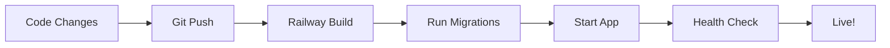

# 🚄 Railway Deployment Quick Reference

**Fast reference for deploying Resume Modifier backend to Railway**

> 📖 For detailed instructions, see [RAILWAY_DEPLOYMENT_COMPLETE_GUIDE.md](./RAILWAY_DEPLOYMENT_COMPLETE_GUIDE.md)

---

## ⚡ 5-Minute Quick Deploy

### Prerequisites
```bash
✅ Railway account: https://railway.app
✅ GitHub repository with code
✅ OpenAI API key
✅ Railway CLI installed (optional): npm i -g @railway/cli
```

### Step 1: Create Project (1 min)
```bash
# Via Railway Dashboard
1. Go to https://railway.app/dashboard
2. Click "New Project" → "Deploy from GitHub repo"
3. Select your Resume_Modifier repository
```

### Step 2: Add Database (30 sec)
```bash
# In Railway Dashboard
1. Click "+ New" → "Database" → "PostgreSQL"
2. Wait for provisioning (~30 seconds)
```

### Step 3: Set Environment Variables (2 min)
```bash
# Via Railway Dashboard: Service → Variables → Add Variables
OPENAI_API_KEY=sk-proj-YOUR-KEY
JWT_SECRET=your-secure-secret
FLASK_SECRET_KEY=your-flask-secret
FLASK_APP=app.server
FLASK_ENV=production
FLASK_DEBUG=0
PORT=5001

# Generate secure secrets:
openssl rand -base64 32
```

### Step 4: Run Migration (1 min)
```bash
# Option A: Automated (recommended)
# Update railway.toml startCommand:
startCommand = "flask db upgrade && python railway_start.py"
git push origin main

# Option B: Manual
./scripts/railway_migrate.py upgrade
```

### Step 5: Verify Deployment (30 sec)
```bash
# Get your app URL from Railway dashboard
curl https://your-app.railway.app/health

# Expected: {"status": "healthy", ...}
```

---

## 🎯 Essential Commands

### Deployment
```bash
railway init              # Initialize new project
railway up               # Deploy
railway logs --tail      # Watch logs
railway domain           # Get app URL
```

### Database Migration
```bash
# Automated script (recommended)
./scripts/railway_migrate.py upgrade
./scripts/railway_migrate.py current

# Manual
DATABASE_URL="postgresql://..." flask db upgrade
```

### Environment Variables
```bash
railway variables                      # List all
railway variables set KEY=value        # Set variable
railway variables get KEY              # Get variable
```

### Database Access
```bash
railway connect postgres              # Connect to database
railway variables --service Postgres  # Get DB credentials
```

---

## 🔧 Troubleshooting

### Issue: Build Failed
```bash
# Check logs
railway logs --tail | grep ERROR

# Verify requirements.txt
cat requirements.txt

# Check Python version
echo "python-3.12" > runtime.txt
```

### Issue: Database Connection Failed
```bash
# Verify DATABASE_URL
railway variables | grep DATABASE_URL

# Test connection
railway connect postgres

# Check migrations
./scripts/railway_migrate.py current
```

### Issue: Health Check Failing
```bash
# Test locally first
python railway_start.py
curl http://localhost:5001/health

# Check Railway logs
railway logs --tail
```

---

## 📋 Environment Variables Checklist

**Required:**
- [ ] `DATABASE_URL` (auto-set by Railway)
- [ ] `OPENAI_API_KEY`
- [ ] `JWT_SECRET`
- [ ] `FLASK_SECRET_KEY`
- [ ] `FLASK_APP=app.server`
- [ ] `FLASK_ENV=production`

**Optional (Google OAuth):**
- [ ] `GOOGLE_CLIENT_ID`
- [ ] `GOOGLE_CLIENT_SECRET`
- [ ] `GOOGLE_REDIRECT_URI`

---

## 📚 File Checklist

**Required files in repository:**
- [ ] `Procfile` → `web: python railway_start.py`
- [ ] `railway.toml` → deployment configuration
- [ ] `requirements.txt` → Python dependencies
- [ ] `railway_start.py` → entry point
- [ ] `migrations/` → database migrations
- [ ] `app/__init__.py` → Flask app factory

---

## 🚀 Deployment Workflow



**Steps:**
1. Make changes locally
2. Test locally: `python railway_start.py`
3. Run tests: `pytest app/tests/ -v`
4. Commit: `git commit -m "message"`
5. Push: `git push origin main`
6. Railway auto-deploys
7. Monitor: `railway logs --tail`
8. Verify: `curl https://your-app.railway.app/health`

---

## 🔐 Security Checklist

- [ ] Strong, random secrets (use `openssl rand -base64 32`)
- [ ] HTTPS enabled (automatic on Railway)
- [ ] No secrets in Git repository
- [ ] Google OAuth redirect URIs updated
- [ ] Database uses internal URL in production
- [ ] Error messages don't leak sensitive data

---

## 📊 Post-Deployment Testing

```bash
# 1. Health check
curl https://your-app.railway.app/health

# 2. API documentation
curl https://your-app.railway.app/apidocs

# 3. User registration
curl -X POST https://your-app.railway.app/api/register \
  -H "Content-Type: application/json" \
  -d '{"username":"test","email":"test@example.com","password":"Test123!"}'

# 4. Database verification
railway connect postgres
\dt  # List tables
\q   # Exit
```

---

## 🆘 Quick Help

**Problem:** Migration errors
**Solution:** `./scripts/railway_migrate.py current`

**Problem:** App won't start
**Solution:** `railway logs --tail | grep ERROR`

**Problem:** Can't connect to DB
**Solution:** `railway connect postgres` (if works, DB is fine)

**Problem:** Environment variable not loading
**Solution:** `railway variables` (check for typos)

**Problem:** OpenAI errors
**Solution:** Test API key: `curl https://api.openai.com/v1/models -H "Authorization: Bearer $KEY"`

---

## 📞 Resources

- 📖 **Complete Guide**: [RAILWAY_DEPLOYMENT_COMPLETE_GUIDE.md](./RAILWAY_DEPLOYMENT_COMPLETE_GUIDE.md)
- 🔄 **Migration Guide**: [RAILWAY_MIGRATION_GUIDE.md](./RAILWAY_MIGRATION_GUIDE.md)
- 🛠️ **Scripts**: [scripts/README.md](./scripts/README.md)
- 📚 **API Docs**: [API_DOCUMENTATION.md](./API_DOCUMENTATION.md)
- 🌐 **Railway Docs**: https://docs.railway.app/

---

**🎉 Need more details? Check the [Complete Deployment Guide](./RAILWAY_DEPLOYMENT_COMPLETE_GUIDE.md)**
